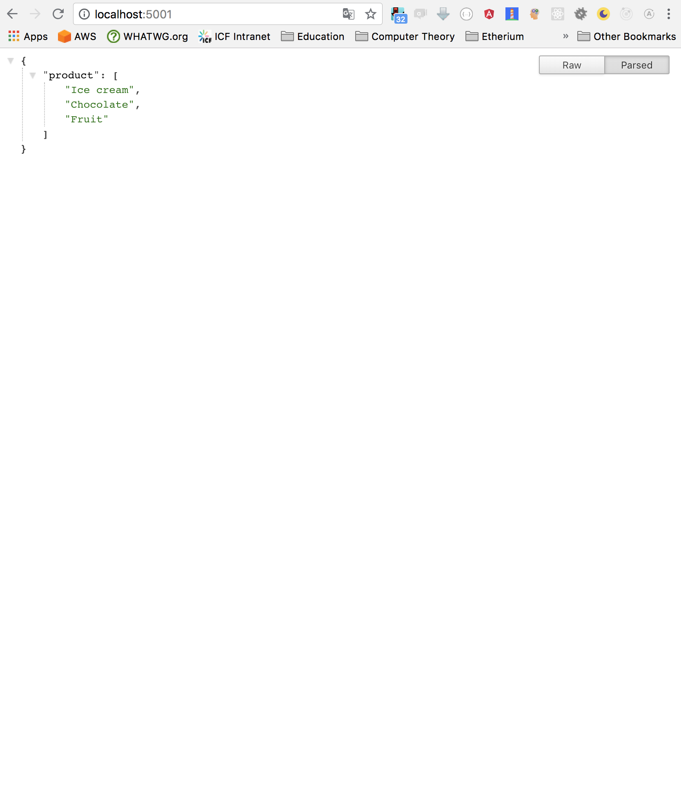

_Quick tutorial from [https://www.youtube.com/watch?v=Qw9zlE3t8Ko](https://www.youtube.com/watch?v=Qw9zlE3t8Ko)_

Notes:

- Run detached `docker-compose up -d`
  - Verify with `docker ps`
- Stop with `docker-compose stop`

End Results:

